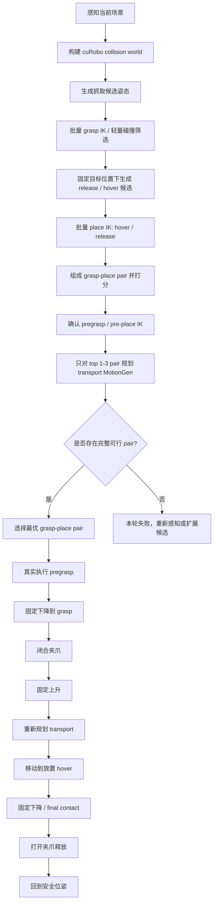

下面这版可以直接复制进 `.md` 文件里。

---

# cuRobo Pick-and-Place 固定流程工作流总结

## 1. 核心设计思想

当前系统采用 **固定动作流程 + 分层候选筛选 + 少量 MotionGen 验证** 的方式完成抓取与放置。

整体原则是：

> 放置目标位置是固定的，不通过改变目标位置来提高成功率；系统主要通过抓取姿态、合法释放姿态和 pair 级 IK 筛选，提前找到少量可能完成整条链路的 grasp-place pair。

也就是说，系统不是先抓起来再判断能不能放，也不是对每个候选都跑完整 MotionGen。正确流程必须是：

```text
批量抓取 IK -> 批量放置 IK -> grasp-place pair 打分 -> pre 位姿 IK 确认 -> 只对 top pair 做 transport MotionGen
```

只有通过 IK/几何筛选并且最终少量 MotionGen 验证成功的 pair，才会被允许进入真实执行阶段。

## 1.1 硬性架构约束：候选阶段不得滥用 MotionGen

这是后续所有修改必须遵守的规则。

正确候选筛选流程如下：

```text
1. 并行/批量确认 grasp pose 是否可达，只做 IK 与轻量碰撞检查。
2. 对每个可抓 grasp，生成固定目标位姿下的 release/hover pose，并批量确认 place IK。
3. 只保留 grasp IK 与 place IK 都成功的 grasp-place pair。
4. 对这些 pair 继续确认两个 pre 位姿：
   pregrasp IK
   pre-place / hover IK
5. 对通过 1-4 的 top 1-3 个 pair 才允许调用 MotionGen 规划运输路径。
6. pregrasp->grasp、grasp->lift、hover->release、release->retreat 是短距离受限直线 primitive。候选阶段可以做 IK/直线一致性验证，但不能调用 MotionGen；真正路径只在最终选中的 pair 上生成和执行。
7. top 1-3 pair 是同一物体的有序 fallback 集合，适用于所有物体类型。top1 的 transport-to-hover 失败时，应继续尝试 top2/top3，而不是立刻判定该物体失败。
8. 球类物体虽然姿态自由，但放置仍然按 surface/contact 流程处理，必须有 hover->release 的最后下降；不得用高位 drop release 代替最终接触放置。
```

明确禁止：

```text
禁止在每个 grasp 候选上先跑 pregrasp MotionGen 再筛选。
禁止在每个 grasp 候选上先跑 final approach MotionGen 再筛选。
禁止在每个 place 候选上逐个跑 transport MotionGen 当作筛选。
禁止用 final_contact MotionGen 作为 joint-search 内层候选筛选。
禁止 fast IK screening 后再进入旧流程重复 IK / 重复 MotionGen。
```

MotionGen 只能用于：

```text
最终 top pair 的 transport-to-hover 全局路径规划
不得用于 pregrasp->grasp / grasp->lift / hover->release / release->retreat 的候选筛选
不得回到“每候选都 MotionGen”的旧流程
```

---

## 2. 总体流程



---

## 3. 工作流分解

## 3.1 场景感知与世界构建

系统首先通过感知模块获得当前场景中的物体位姿，包括：

* 当前待抓取物体
* 桌面 / desk
* 目标容器或目标放置区域
* 其他障碍物
* 虚拟安全墙或边界

随后将这些物体转换成 cuRobo 的 collision world。

cuRobo 规划时主要依赖：

```text
scene_obstacle_desk
scene_obstacle_xxx
virtual_table_plane
virtual_side_wall
virtual_top_wall
active_target_object
```

其中 `active_target_object` 在抓取前通常作为目标物体参与碰撞建模，用于判断夹爪靠近目标物体时是否可达。

---

## 3.2 抓取候选生成

抓取阶段不应该只验证一个固定抓取角度，而是生成多个候选抓取姿态。

但是这些候选主要应该改变：

```text
grasp tilt
grasp yaw
必要时少量 wrist orientation
```

不应该过度改变：

```text
抓取中心位置
物体目标放置位置
放置目标中心点
```

当前设计中，抓取泛化主要靠 tilt 搜索。例如：

```text
tilt_toward_robot_8deg
tilt_toward_robot_12deg
tilt_toward_robot_16deg
tilt_toward_robot_20deg
tilt_toward_robot_30deg
tilt_away_8deg
tilt_away_12deg
```

每个候选抓取角度都会生成对应的：

```text
pregrasp pose
grasp pose
TCP-object transform
```

---

## 3.3 抓取前分层链路验证

这是当前工作流最重要的部分。

对于每一个抓取候选，系统在真实执行前要判断：

```text
这个抓取角度抓起来之后，后面的 transport 和 place 是否也能成功？
```

但是这个判断必须分层完成，不能把每个候选都送进 MotionGen。

候选阶段只允许做：

1. 是否能到达 `pregrasp`
2. 是否能到达 `grasp`
3. 该 grasp 对应的 `hover / release` 是否有 IK
4. `pre-place / hover` 是否有 IK
5. pair 的 joint distance、关节限位余量、attached object 低点、明显碰撞是否合理

完整 MotionGen 验证只允许发生在 top pair 阶段：

```text
只对 IK/几何筛选后排名靠前的 1-3 个 pair 规划 transport-to-hover。
```

因此，候选判断不是旧流程：

```text
grasp MotionGen -> final approach MotionGen -> attach -> transport MotionGen -> final contact MotionGen
```

而是新流程：

```text
grasp IK + place IK + pre IK + pair score -> top pair MotionGen
```

---

## 3.4 抓取固定下降

抓取动作采用固定流程：

```text
pregrasp -> fixed descent -> grasp
```

也就是说，抓取前不应该让 planner 随便绕路贴近物体，而应该先规划到一个安全的 pregrasp，再沿着固定接近方向短距离下降到 grasp pose。

这样做的好处是：

* 减少夹爪从侧面扫到目标物体
* 减少与桌面摩擦
* 抓取动作更稳定
* 实机行为更可控
* 更接近人类设计的 pick primitive

这一步只在最终选中的 pair 上执行一次。候选筛选阶段不得对每个候选重复规划这段 MotionGen。

如果需要规划，应优先使用 cuRobo PoseCostMetric / constrained linear motion 这类受限直线规划；失败时才允许少量 fallback。

---

## 3.5 夹爪闭合后固定上升

夹爪闭合后，系统不应该立刻做横向 transport，而应该先执行固定上升：

```text
grasp -> close gripper -> fixed post-grasp lift
```

例如：

```text
lift height: 0.10 m
minimum TCP z: 0.16 m
```

这个动作的作用是：

* 避免物体刚抓起时仍然接触桌面
* 避免横移时物体扫到桌面或附近障碍物
* 减少物体被拖拽导致飞出
* 给后续 transport 提供更干净的起始状态

因此，碰撞问题不应该完全靠 planner 事后绕，而应该通过固定 primitive 保证安全结构：

```text
抓取前固定下降
抓取后固定上升
放置前固定 hover
放置时固定下降
```

---

## 3.6 放置位置固定

放置目标位置是由任务规则或目标物体决定的，原则上不应该随意改变。

例如：

```text
笔要插入笔筒
薯片桶要放到目标区域
球要放到指定位置
物体要放到固定桌面坐标或目标 pad 上
```

因此，放置阶段默认固定：

```text
target position
target center
target surface/contact point
```

cuRobo 可以尝试的是：

```text
放置时的 TCP 姿态
物体绕自身轴的旋转
球类物体的任意释放姿态
```

而不是改变最终目标位置。

---

## 3.7 不同物体的放置自由度

不同类别的物体拥有不同的放置自由度。

### 3.7.1 普通物体

普通物体的放置姿态应该尽量固定，只允许少量必要姿态调整。

目标是保证：

```text
位置准确
姿态稳定
释放时不碰撞
```

---

### 3.7.2 长轴物体，例如 bi、hongshupian

对于 `bi`、`hongshupian` 这类具有明显长轴的物体，放置位置仍然固定，但可以尝试绕物体自身轴做 raw / roll / axial spin 旋转。

也就是说：

```text
目标中心不变
目标高度不变
目标区域不变
只改变绕长轴的旋转角
```

可尝试的角度例如：

```text
0°
-45°
45°
-90°
90°
180°
```

这样做的目的是给 cuRobo 更多 IK 和避障分支，同时不破坏任务语义。

---

### 3.7.3 球类物体

球类物体的姿态本身通常不重要，只要球心落在目标位置即可。

因此球类物体可以允许更大的姿态自由度：

```text
roll 可变
tilt 可变
yaw 可变
```

系统只需要保证：

```text
球心位置正确
释放高度合理
夹爪不碰撞目标区域
球不会被夹爪扫飞
```

对于球，放置候选可以更宽，例如：

```text
tilt: 0°, ±12°, ±24°, ±36°
roll: 0°, ±45°, ±90°, ±135°, 180°
```

---

## 4. cuRobo 在流程中的作用

cuRobo 不是直接决定任务逻辑，而是作为候选验证器和轨迹生成器。

任务逻辑由固定 primitive 决定：

```text
pregrasp
fixed descent
close gripper
fixed lift
transport
pre-place / hover
fixed descent
release
return
```

cuRobo 负责判断每一段是否可行：

```text
是否 IK 可达
是否轨迹可规划
是否碰撞安全
是否满足关节限制
是否满足末端姿态约束
```

因此 cuRobo 的角色分两层：

```text
候选阶段：批量 IK / 轻量碰撞 / pair 打分
最终验证阶段：只对 top pair 做 MotionGen 路径生成
```

---

## 5. 为什么要抓取前判断完整链路

如果只判断抓取是否成功，会出现以下问题：

```text
抓起来了，但后面放不进去
抓起来了，但 transport 会撞桌子
抓起来了，但目标容器附近姿态不可达
抓起来了，但 final contact 没有 IK
抓起来了，但放置角度导致物体飞出
```

因此系统必须在抓取前就判断：

```text
这个 grasp tilt 是否支持后续完整任务？
```

这也是当前固定工作流的关键，但判断方式必须是分层筛选：

> 不是找一个最容易抓的姿态，也不是对所有候选做完整规划，而是先用批量 IK 找到可抓且可放的 pair，再只对少量 top pair 做 MotionGen。

---

## 6. 推荐的状态机

```text
STATE 0: Perception
    获取当前物体、桌面、目标区域、障碍物位姿

STATE 1: Build World
    构建 cuRobo collision world

STATE 2: Generate Grasp Candidates
    生成多个 grasp tilt / yaw 候选

STATE 3: Batched Grasp IK Screening
    批量判断 pregrasp 与 grasp 是否有 IK

STATE 4: Batched Place IK Screening
    对每个 grasp 的 T_tcp_obj 生成固定目标 release / hover，并批量判断 IK

STATE 5: Pair Scoring
    只保留 grasp/place/pre 位姿都有 IK 的 pair，并按 joint distance / limit / clearance 打分

STATE 6: Top Pair Transport MotionGen
    只对 top 1-3 pair 做 transport-to-hover MotionGen

STATE 7: Candidate Selection
    选择代价最低、完整链路可行的 pair

STATE 8: Real Execution
    执行 pregrasp、下降、闭合、上升、transport、放置、释放

STATE 9: Return / Next Object
    返回安全位姿，进入下一个物体流程
```

---

## 7. 当前流程的核心约束

当前系统应该满足以下约束：

```text
1. 放置目标位置固定
2. 抓取前必须用分层筛选验证完整链路可能性
3. 候选阶段只允许 IK / 几何 / 轻量碰撞 / pair score
4. MotionGen 不得出现在候选搜索内层
5. 只对 top 1-3 grasp-place pair 规划 transport-to-hover
6. 抓取动作采用 pregrasp + fixed descent
7. 抓取后必须 fixed lift
8. 放置前必须有 hover / pre-place
9. 放置时采用 fixed descent / final contact
10. 长轴物体允许 axial spin
11. 球类物体允许更自由的 roll / tilt
12. 不应该默认复用预筛选阶段的 transport path，除非该 path 就是最终 top pair 的 MotionGen 结果
13. 真实执行前后需要尽量刷新当前 collision world
```

---

## 8. 失败原因定位

如果流程失败，可以根据日志判断失败阶段。

### 8.1 抓取 IK 失败

典型日志：

```text
MotionGenStatus.IK_FAIL
final approach to real grasp pose failed
```

说明当前抓取 tilt 下，`pregrasp -> grasp` 或最终 grasp pose 不可达。

解决方式：

```text
扩大 grasp tilt 候选
增加 grasp yaw 候选
启用 segmented IK fallback
检查目标物体姿态是否估计错误
```

---

### 8.2 抓取后 transport 失败

典型日志：

```text
no transport-hover chain stayed feasible
transport_to_hover failed
```

说明抓取本身可能可行，但抓取后的物体姿态导致后续移动失败。

解决方式：

```text
更换 grasp tilt
增加 post-grasp lift 高度
检查 attached object collision model
检查桌面高度和障碍物建模
```

---

### 8.3 final contact 失败

典型日志：

```text
final_contact failed
release descent failed
```

说明已经能到达放置 hover，但是最后下降释放不可行。

解决方式：

```text
增加 hover height
调整 release clearance
对长轴物体增加 axial spin
对球类物体增加 roll / tilt 候选
检查目标区域高度是否准确
```

---

### 8.4 实机物体飞出

常见原因：

```text
桌面高度估计不准
真实物体位姿和仿真 attached pose 不一致
夹爪闭合时挤动物体
post-grasp lift 不够
release pose 太低
final descent 与目标物体/桌面发生接触
collision world 过于理想化
```

优先检查：

```text
post-grasp lift 是否启用
table z 是否准确
active object bottom z 是否合理
attached sphere 是否穿桌
release height 是否过低
夹爪打开时是否仍在碰物体
```

---

## 9. 总结

当前 pick-and-place 系统应该被理解为：

> 一个固定 primitive 流程下的多候选姿态搜索系统。

系统不依赖随机移动目标位置来解决问题，而是通过批量 IK 筛选不同抓取 tilt 与合法放置姿态自由度，先找到可抓可放的 grasp-place pair，再只对少量 top pair 使用 cuRobo MotionGen 判断运输路径是否可行。

最终目标是：

```text
用固定、可解释、可控的动作流程保证实机稳定性；
用 cuRobo 的批量 IK 能力搜索可行姿态；
把 MotionGen 从候选搜索内层移到最终 top pair 验证阶段；
用抓取前分层链路验证提高泛化性、成功率和速度。
```
